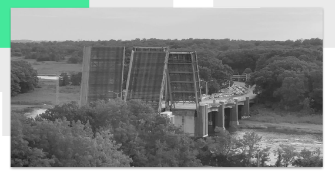
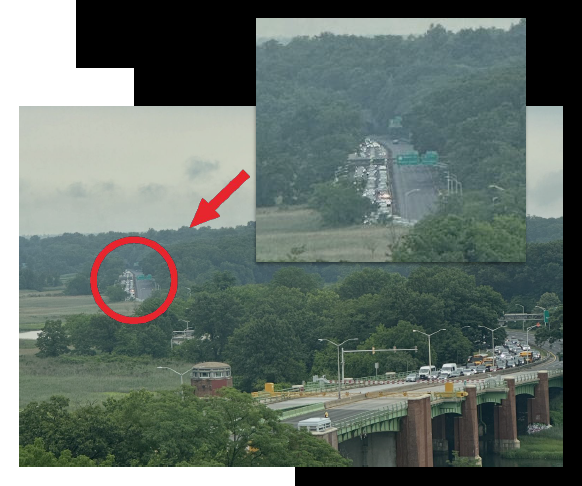

# Watch the Hutch



Watch the Hutch is a commuter-facing bridge status app for the Hutchinson River drawbridge. The goal is simple: make bridge openings, traffic impact, wait time, and data confidence understandable at a glance so drivers can decide whether to wait, reroute, or keep moving.

## The Problem

The drawbridge opens for frequent marine traffic, which can create commuter delays of 20-25 minutes. Today, drivers have limited visibility into whether the bridge is open, how backed up each direction is, or whether the latest status is reliable enough to act on.



The broader system is designed in three layers:

- **Edge/AI detection:** a planned Raspberry Pi + Python/OpenCV pipeline that detects bridge and traffic state.
- **Cloud + data:** Firebase stores the latest bridge state, event history, simulations, auth, timestamps, and confidence values.
- **Web app:** this Next.js app turns raw bridge state into plain-language status, traffic summaries, a 3D visualizer, admin controls, and simulation playback.

## Current Features

- **Public status experience:** the home page shows the current bridge position, northbound/southbound traffic, last updated time, confidence, estimated wait time, and a 3D visual state.
- **Plain-language commuter guidance:** raw states such as `open`, `closed`, `opening`, and `standstill` are translated into readable guidance instead of requiring users to interpret infrastructure terms.
- **Traffic direction summaries:** northbound and southbound traffic can be tracked independently.
- **Estimated wait time:** opening/closing states can display a countdown, ETA-style timing, and progress.
- **Loading, error, missing, and unknown states:** the UI has user-facing fallbacks when live data is unavailable or uncertain.
- **Admin dashboard:** authenticated admins can view the current state, switch data sources, update bridge position/traffic, and set estimated wait times.
- **Simulation builder:** admins can create, edit, delete, and replay timed bridge scenarios against the same home-page experience.
- **Live or local data source:** the app can use Firebase for shared live data or browser localStorage for demos and local testing.

## Tech Stack

- **Framework:** Next.js 16 App Router, React 19, TypeScript
- **Styling:** Tailwind CSS 4
- **3D rendering:** Three.js, React Three Fiber, Drei
- **Backend services:** Firebase Auth and Firestore
- **Hosting target:** Vercel

## Project Structure

This project uses the Next.js App Router inside `src/app`. Route groups such as `(protected)` organize admin-only routes without adding that segment to the URL.

```txt
watch-the-hutch-web/
├── public/                         # Static assets served by Next.js
├── src/
│   ├── app/                        # App Router pages, layouts, and global styles
│   │   ├── page.tsx                # Public commuter status experience
│   │   ├── layout.tsx              # Root app shell
│   │   ├── globals.css             # Tailwind/global CSS
│   │   └── admin/
│   │       ├── login/page.tsx      # Firebase email/password login
│   │       └── (protected)/
│   │           ├── layout.tsx      # Auth gate for admin routes
│   │           ├── dashboard/page.tsx
│   │           └── simulations/[simulationId]/page.tsx
│   ├── components/
│   │   ├── 3D/                     # Shared bridge, river, boat, and direction visuals
│   │   └── Navbar.tsx
│   ├── features/
│   │   ├── auth/                   # Firebase auth service, provider, hooks, types
│   │   ├── bridge-state/           # Bridge domain model, UI, hooks, repositories, services
│   │   └── simulations/            # Simulation domain model, builder, playback, persistence
│   └── lib/
│       ├── errors.ts               # Shared error helpers
│       └── firebase/               # Firebase SDK, Auth, Firestore, collection names
├── next.config.ts
├── package.json
└── tsconfig.json
```

## Domain Model

The core bridge state is intentionally small and composable:

- **Position:** `closed`, `opening`, `open`, `closing`, or `unknown`
- **Traffic:** independent northbound and southbound traffic values: `light`, `moderate`, `heavy`, `standstill`, or `unknown`
- **Confidence:** numeric confidence values for bridge position and traffic state
- **Estimated wait time:** optional countdown/progress metadata for active openings
- **Source:** whether state came from a device or an admin override
- **Updated timestamp:** used to communicate freshness and reliability

This lets detection, storage, and presentation evolve independently. The planned detection layer can publish the same shape of data that the admin editor creates today.

## Getting Started

### Prerequisites

- Node.js compatible with Next.js 16
- npm
- A Firebase project if you want live shared data and admin login

### Install

```bash
npm install
```

### Configure Environment

Create `.env.local` in the project root. Next.js loads environment files from the root of the project, not from `src/`.

```bash
NEXT_PUBLIC_FIREBASE_API_KEY=your-api-key
NEXT_PUBLIC_FIREBASE_AUTH_DOMAIN=your-project.firebaseapp.com
NEXT_PUBLIC_FIREBASE_PROJECT_ID=your-project-id
NEXT_PUBLIC_FIREBASE_APP_ID=your-app-id
```

These values are public Firebase client config values and are used by the browser bundle. Do not commit `.env.local`.

### Run Locally

```bash
npm run dev
```

Open [http://localhost:3000](http://localhost:3000) for the commuter experience.

Admin routes:

- [http://localhost:3000/admin/login](http://localhost:3000/admin/login)
- [http://localhost:3000/admin/dashboard](http://localhost:3000/admin/dashboard)

Use Firebase email/password credentials for the admin dashboard. Once inside the dashboard, the data source toggle can switch the app between Firebase-backed live data and localStorage-backed demo data.

## Available Scripts

```bash
npm run dev      # Start the local development server
npm run build    # Create a production build
npm run start    # Run the production build
npm run lint     # Run ESLint
```

## Firebase Data

The app expects Firestore collections for the current bridge state (`bridgeState`), event history (`events`), and simulations (`simulations`). Repository implementations live behind feature-level interfaces, so the app can swap between Firebase and localStorage without changing UI components.

Useful files:

- `src/features/bridge-state/bridge-state.repository.ts`
- `src/features/bridge-state/repositories/firebase-bridge-state.repository.ts`
- `src/features/bridge-state/repositories/localStorage-bridge-state.repository.ts`
- `src/features/simulations/simulation.repository.ts`
- `src/features/simulations/repositories/firebase-simulation.repository.ts`
- `src/features/simulations/repositories/localStorage-simulation.repository.ts`

