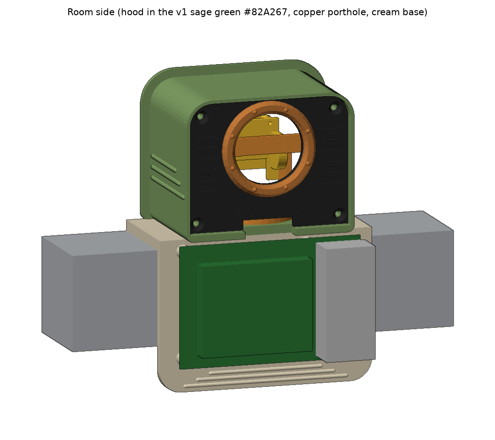
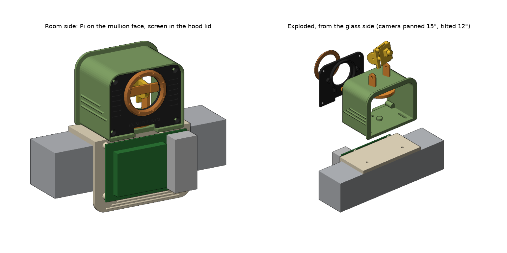
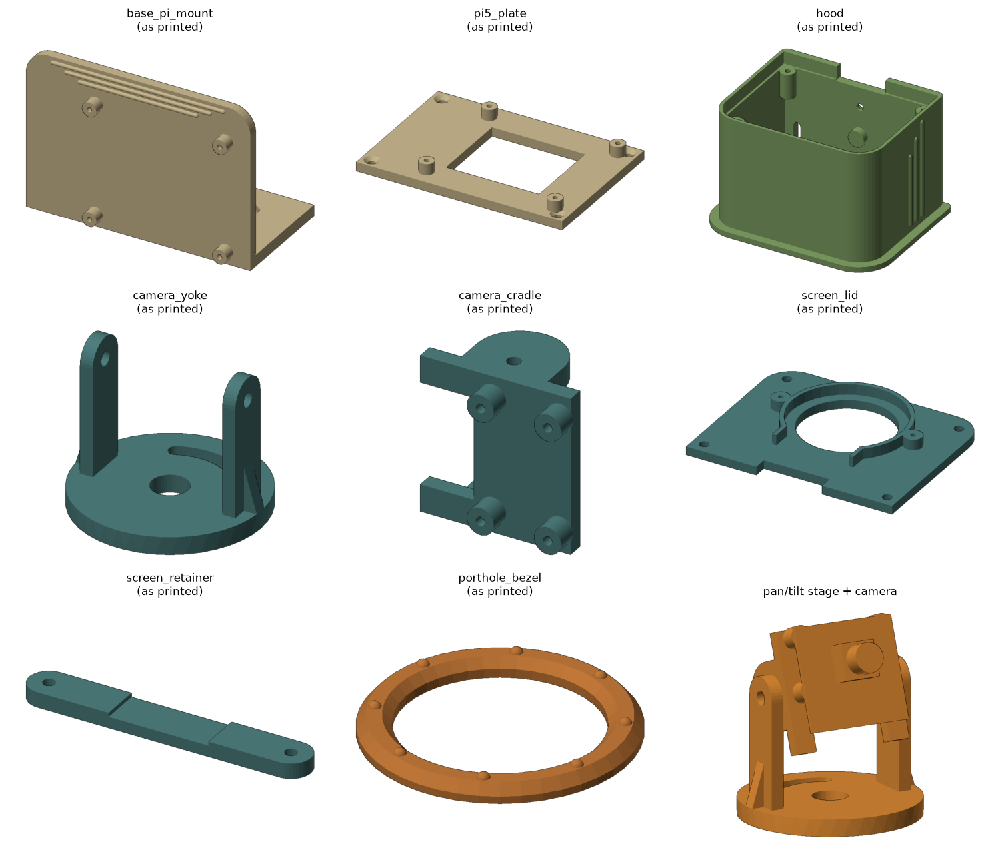

# Watch The Hutch window mount v2, retro porthole styling

Same mount as v2 (every hole, slot, nut pocket and screw is unchanged) with a retro-futuristic outside: a rounded TV-cabinet hood with speed-line ribs, the screen recessed in a CRT-style frame, a riveted copper porthole around the round display, grille slots and a "WATCH THE HUTCH" badge on the lid, and a rounded cream base with speed lines under the Pi.

Underneath the styling it is a mullion cap like v1.0 with a new Pi 5 mount on the room face, a light-tight camera hood that seals against the glass, a pan/tilt cradle for the Camera Module 3 NoIR inside the hood, and the 1.28" round display set into the hood's room-facing lid.

## Files

| Part | STL (already oriented for printing) | Print size (mm) | What it does |
|---|---|---|---|
| base_pi_mount | `stl/base_pi_mount.stl` | 100 x 54 x 70 | Sits on the mullion. Pi 5 screws to the room face (ports on the right, GPIO on top, as in your photo). Two captive M3 nuts in the top hold the hood. |
| pi5_plate | `stl/pi5_plate.stl` | 93 x 64 x 9 | Only if you keep the v1.0 base: a Pi 5 plate with 4 countersunk M3 holes to screw/glue onto the old base's front face. |
| hood | `stl/hood.stl` | 87 x 68.5 x 56 | Rounded box open toward the glass with a gasket flange; the back runs 6 mm past the lid as a screen frame. Slots let it slide 7 mm toward/away from the glass. |
| camera_yoke | `stl/camera_yoke.stl` | 42 x 42 x 34 | Pan stage: turns on a pin in the hood floor, ±25°, locked by one M3 screw in an arc slot. |
| camera_cradle | `stl/camera_cradle.stl` | 29 x 20 x 28.5 | Tilt stage: camera screws on the front, ±25° tilt, held by two M3 screws through the yoke arms. |
| screen_lid | `stl/screen_lid.stl` | 75.5 x 59.5 x 7 | Sits inside the hood frame facing the room: 33 mm display window, grille slots, engraved badge, cable exit at the bottom. |
| screen_retainer | `stl/screen_retainer.stl` | 56.5 x 8 x 3 | Clamps the display into the lid. |
| porthole_bezel | `stl/porthole_bezel.stl` | 44 x 44 x 4 | Riveted ring around the display, located by 3 filament dowels and glued. |

Everything fits the FlashForge Finder v1 (140 x 140 x 140). `step/` has the same parts as STEP for Fusion 360, plus `assembly_all_parts.step` with every part in its installed position.

## Printing (Finder v1)

- PLA (the Finder v1 bed is unheated). Colours: hood in the same sage green as the v1 mount (about #82A267, sampled from IMG_7020; easiest is to reuse that spool), lid black, porthole in copper or brass silk PLA, base cream. Paint the inside of the green hood matte black (or line it with black flocking/tape) so room light doesn't glow through the walls or reflect into the camera.
- The lid prints display-face down, so its grille and badge are engraved into the first layers. If they come out soft, lower the first-layer squish a little.
- 0.2 mm layers, 3 perimeters, 25% infill. No supports needed in the orientations the STLs are saved in.
- Print the hood with the glass flange on the bed. Print the base with its top surface on the bed and the Pi wall standing up.

## Hardware

| Qty | Part | Where |
|---|---|---|
| 4 | M2.5 x 8 screws (self-tapping into 2.2 mm holes) | Pi 5 to base or plate |
| 4 | M2 x 6 self-tapping screws | Camera to cradle |
| 2 | M2 x 8 self-tapping screws | Display retainer |
| 2 | M3 x 8 + M3 nuts + washers | Hood to base (nuts sit in the base underside; longer screws would poke out under the base) |
| 1 | M3 x 8 + M3 nut + washer | Pan lock (nut sits in the hood floor underside) |
| 2 | M3 x 8 | Tilt (thread straight into the cradle) |
| 4 | M3 x 10 countersunk, self-tapping | Lid to hood |
| 3 | 4 mm pieces of 1.75 mm filament + a drop of CA glue | Porthole bezel dowels |
| ~30 cm | 3-5 mm self-adhesive black foam weatherstrip | Hood flange against the glass |
| | 3M VHB or Command strips | Base to mullion (top and front) |
| 1 | Pi 5 camera cable, 200 mm or longer (22-pin to 15-pin) | Camera to Pi |

## Assembly

1. Push two M3 nuts into the hex pockets under the base top, and one M3 nut into the pocket under the hood floor.
2. Screw the Camera Module 3 to the cradle (lens facing out, ribbon connector at the bottom). Attach the camera cable.
3. Put the yoke on the hood-floor pin, then the cradle between the yoke arms with the two tilt screws. Snug them so the camera holds its angle.
4. Add the pan-lock screw through the arc slot.
5. Bolt the hood to the base through the floor slots. Stick foam weatherstrip on the hood flange.
6. Seat the display in the lid ring (pins down), clamp with the retainer. Push the 3 filament dowels into the lid face, glue the porthole bezel on.
7. Screw the Pi 5 to the base. Fit the base on the mullion with VHB, slide the hood until the foam touches the glass, tighten.
8. Aim the camera (tilt/pan with the lid off, using an L hex key from the back), then route the camera cable and display wires out of the lid notch, screw the lid on, and cover the leftover gap in the notch with black tape so no room light gets in.

## Things to measure and adjust

The base is sized from your photo, not from the Fusion file, so check these in `source/wth_mount.py` (all at the top) and re-run `python3 source/wth_mount.py` (needs `pip install cadquery`), or edit the STEP in Fusion directly:

- `MULLION_DEPTH` (45 mm guess): mullion top from the glass bead to the room face.
- `MULLION_FACE_H` (44 mm guess): height of the mullion's room-facing face.
- `DISP_PCB_D` (39.5 mm guess) and `DISP_TAB_W`/`DISP_TAB_H`: round display board diameter and pin tab size.
- `PORTS_ON_ROOM_RIGHT`: flip if you want the USB/Ethernet on the other side.

