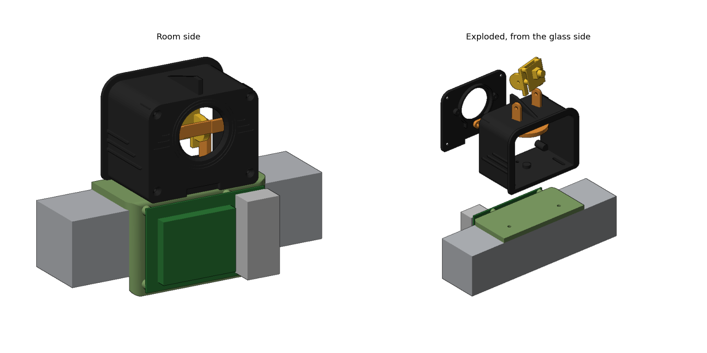
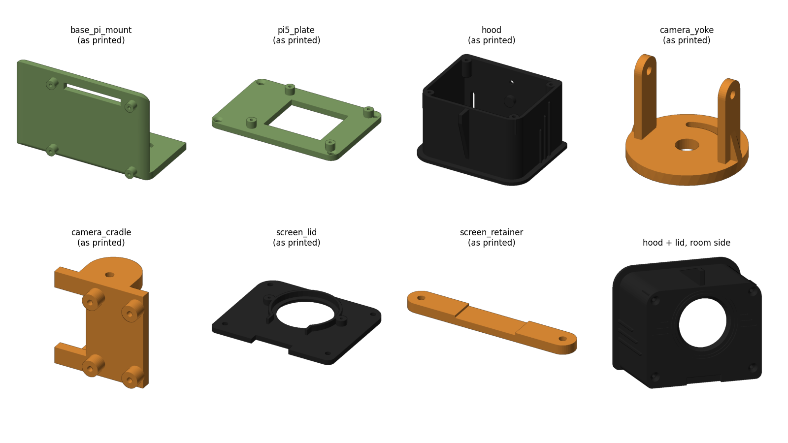

# Watch The Hutch window mount v2, retro restyle

A 1950s space-age restyle of [window-mount-v2](../window-mount-v2). **Only the outside changed**: every hole, slot, boss, nut pocket, fit and screw is the same as v2, so the v2 hardware list, print settings and assembly steps all still apply.

## What changed

| Part | Change |
|---|---|
| hood | Rounded "vintage TV" body (10 mm top corners, 4 mm bottom corners so the floor still sits flat on the base), matching rounded gasket flange, a swept tail fin on top (10 mm tall at the room end), and three speed-line ribs on each side that start at the flange and get shorter toward the room. |
| screen_lid | Same rounded outline as the hood, a porthole bezel (2 mm 45° bevel round the display window plus two engraved rings) and engraved speed-line "wings" either side of the display. |
| base_pi_mount | Rounded room-side corners and bottom corners of the Pi wall, rounded top front edge. |
| pi5_plate | Rounded corners. |
| screen_retainer | Refitted to the measured display (see below); otherwise unchanged. |
| camera_yoke, camera_cradle | Unchanged (inside the hood). |

Print sizes: the hood is now 87 x 74.5 x 50 mm because of the fin (still fits the Finder v1). Everything else is the same size as v2.

The lid ring and retainer use measurements from Jonny's GC9A01 model instead of the v2 estimates: round PCB 38.0 mm (was 39.5), pin tab 23.0 mm wide (was 26) and 9.5 mm below the circle (was 9), glass + PCB 3.6 mm thick (was 3.8). These are set at the top of `source/wth_mount_retro.py`.

## Printing notes

- Same orientations as v2 (the STLs in `stl/` are already oriented). The fin and ribs print vertically with the hood flange on the bed, no supports.
- The lid prints display-face down, so the engraved lines are on the bed side. Watch for elephant's foot closing them; lower the first-layer squish if they come out shallow.
- Colours: hood and screen lid in matte black (#1A1A1A in the CAD) to block as much light as possible; base and Pi 5 plate in sage green #82A267 (RGB 130, 162, 103), matched to the v1 mount in IMG_7020; orange or brass pan/tilt parts.

## Files

- `step/`: STEP for Fusion 360, plus `assembly_all_parts.step` with every part in its installed position.
- `stl/`: print-ready STLs.
- `source/wth_mount_retro.py`: the restyle. It imports `../window-mount-v2/source/wth_mount.py` for all the functional geometry and parameters, so measurement changes (mullion, display, Pi ports) go in that file. Style knobs are at the top of the retro file (`R_TOP`, `FIN`, `FIN_H`, `SPEED_Z`, ...). Run `python3 source/wth_mount_retro.py` (needs `pip install cadquery`), then `python3 source/render_retro.py` for previews.

