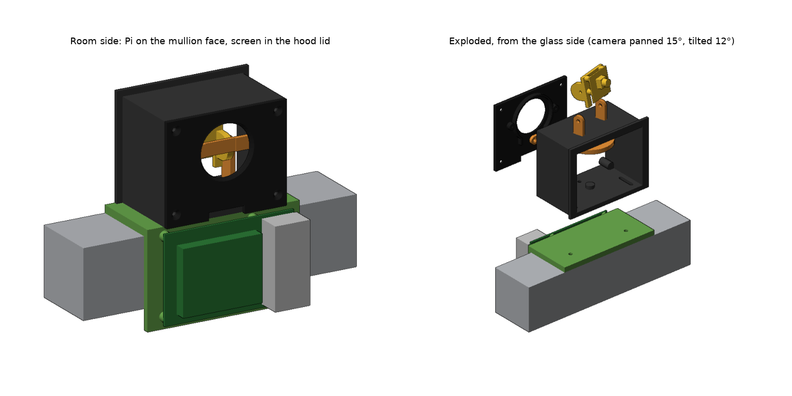
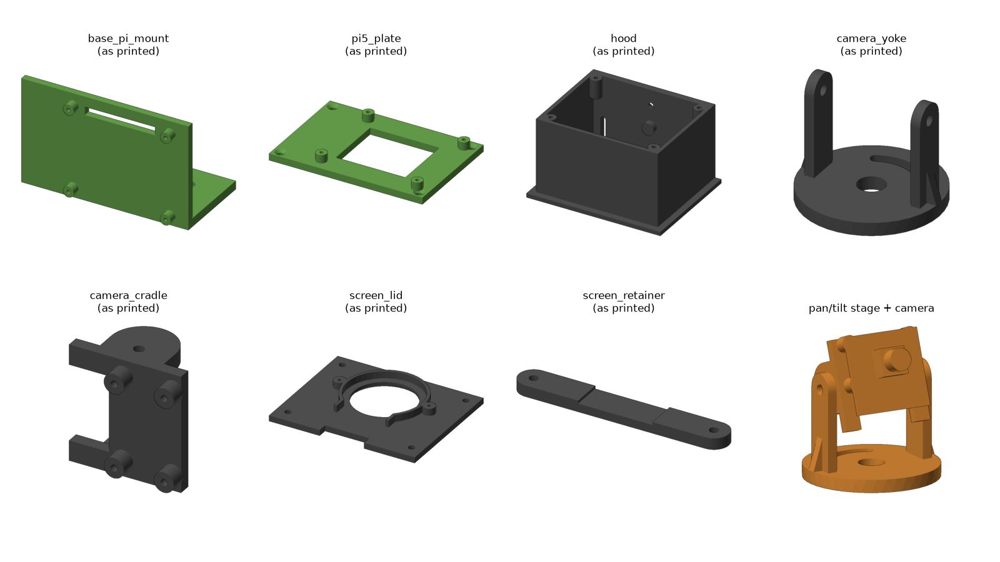

# Watch The Hutch window mount v2

A mullion cap like v1.0 with a new Pi 5 mount on the room face, a light-tight camera hood that seals against the glass, a pan/tilt cradle for the Camera Module 3 NoIR inside the hood, and the 1.28" round display set into the hood's room-facing lid.

## Files

| Part | STL (already oriented for printing) | Print size (mm) | What it does |
|---|---|---|---|
| base_pi_mount | `stl/base_pi_mount.stl` | 100 x 54 x 62 | Sits on the mullion. Pi 5 screws to the room face (ports on the right, GPIO on top, as in your photo). Two captive M3 nuts in the top hold the hood. |
| pi5_plate | `stl/pi5_plate.stl` | 93 x 64 x 9 | Only if you keep the v1.0 base: a Pi 5 plate with 4 countersunk M3 holes to screw/glue onto the old base's front face. |
| hood | `stl/hood.stl` | 87 x 68.5 x 50 | Box open toward the glass with a gasket flange. Slots let it slide 7 mm toward/away from the glass. |
| camera_yoke | `stl/camera_yoke.stl` | 42 x 42 x 34 | Pan stage: turns on a pin in the hood floor, ±25°, locked by one M3 screw in an arc slot. |
| camera_cradle | `stl/camera_cradle.stl` | 28.5 x 20 x 29 | Tilt stage: camera screws on the front, ±25° tilt, held by two M3 screws through the yoke arms. |
| screen_lid | `stl/screen_lid.stl` | 79 x 64.5 x 6.8 | Back of the hood facing the room, with a 33 mm window for the round display and a cable exit at the bottom. |
| screen_retainer | `stl/screen_retainer.stl` | 56.5 x 8 x 3 | Clamps the display into the lid. |

Everything fits the FlashForge Finder v1 (140 x 140 x 140). `step/` has the same parts as STEP for Fusion 360, plus `assembly_all_parts.step` with every part in its installed position.

`WTH_Window_Mount_v2_Fusion.zip` is a Fusion 360 script that uploads `assembly_all_parts.step` as one design, with every part as a component inside it. Fusion for personal use allows only 10 editable documents, so don't upload the parts as separate files; to get one part out, right-click its component and use Save As Mesh.

## Printing (Finder v1)

- PLA (the Finder v1 bed is unheated). Print the hood, lid and retainer in **black** so the hood doesn't glow or reflect inside.
- 0.2 mm layers, 3 perimeters, 25% infill. No supports needed in the orientations the STLs are saved in.
- Print the hood with the glass flange on the bed. Print the base with its top surface on the bed and the Pi wall standing up.

## Hardware

| Qty | Part | Where |
|---|---|---|
| 4 | M2.5 x 8 screws (self-tapping into 2.2 mm holes) | Pi 5 to base or plate |
| 4 | M2 x 6 self-tapping screws | Camera to cradle |
| 2 | M2 x 8 self-tapping screws | Display retainer |
| 2 | M3 x 8 + M3 nuts + washers | Hood to base (nuts sit in the base underside; longer screws would poke out under the base) |
| 1 | M3 x 8 + M3 nut + washer | Pan lock (nut sits in the hood floor underside) |
| 2 | M3 x 8 | Tilt (thread straight into the cradle) |
| 4 | M3 x 10 countersunk, self-tapping | Lid to hood |
| ~30 cm | 3-5 mm self-adhesive black foam weatherstrip | Hood flange against the glass |
| | 3M VHB or Command strips | Base to mullion (top and front) |
| 1 | Pi 5 camera cable, 200 mm or longer (22-pin to 15-pin) | Camera to Pi |

## Assembly

1. Push two M3 nuts into the hex pockets under the base top, and one M3 nut into the pocket under the hood floor.
2. Screw the Camera Module 3 to the cradle (lens facing out, ribbon connector at the bottom). Attach the camera cable.
3. Put the yoke on the hood-floor pin, then the cradle between the yoke arms with the two tilt screws. Snug them so the camera holds its angle.
4. Add the pan-lock screw through the arc slot.
5. Bolt the hood to the base through the floor slots. Stick foam weatherstrip on the hood flange.
6. Seat the display in the lid ring (pins down), clamp with the retainer.
7. Screw the Pi 5 to the base. Fit the base on the mullion with VHB, slide the hood until the foam touches the glass, tighten.
8. Aim the camera (tilt/pan with the lid off, using an L hex key from the back), then route the camera cable and display wires out of the lid notch, screw the lid on, and cover the leftover gap in the notch with black tape so no room light gets in.

## Cable routing

The cable routing diagram is in `../window-mount-v2-porthole/previews/cable_routing.png` (same path for this version).
1. **Camera ribbon.** Use a Pi 5 camera cable (22-pin to 15-pin). 200 mm is enough: the path is about 150 mm, which leaves slack for pan and tilt. From the camera's connector it drops out of the bottom of the cradle, lies flat over the turntable between the yoke arms and over the pan-lock screw (a low button-head M3 there gives the most room), and leaves through the notch at the bottom of the lid. Outside, it runs straight down the 5 mm gap between the base and the back of the Pi, folds around the Pi's bottom edge and plugs into one of the Pi's camera connectors there. Leave about 2 cm of slack inside the hood so the camera can pan and tilt.
2. **Display wires.** The straight jumper plugs on the display's header point toward the camera; fold the wires back underneath them, along the floor and out of the same notch, then forward over the Pi's top edge into the GPIO pins: VCC pin 1, GND pin 6, SDA pin 19, SCL pin 23, CS pin 24, DC pin 22, RST pin 13. The plugs clear the camera mount by about 2.5 mm at full pan and tilt; for more room, solder the wires to the display or use right-angle plugs.
3. **Seal the notch.** Once both cables are through, cover the rest of the notch with black foam or tape so no room light gets into the hood.

## Things to measure and adjust

The base is sized from your photo, not from the Fusion file, so check these in `source/wth_mount.py` (all at the top) and re-run `python3 source/wth_mount.py` (needs `pip install cadquery`), or edit the STEP in Fusion directly:

- `MULLION_DEPTH` (45 mm guess): mullion top from the glass bead to the room face.
- `MULLION_FACE_H` (44 mm guess): height of the mullion's room-facing face.
- `DISP_PCB_D` (39.5 mm guess) and `DISP_TAB_W`/`DISP_TAB_H`: round display board diameter and pin tab size.
- `PORTS_ON_ROOM_RIGHT`: flip if you want the USB/Ethernet on the other side.

